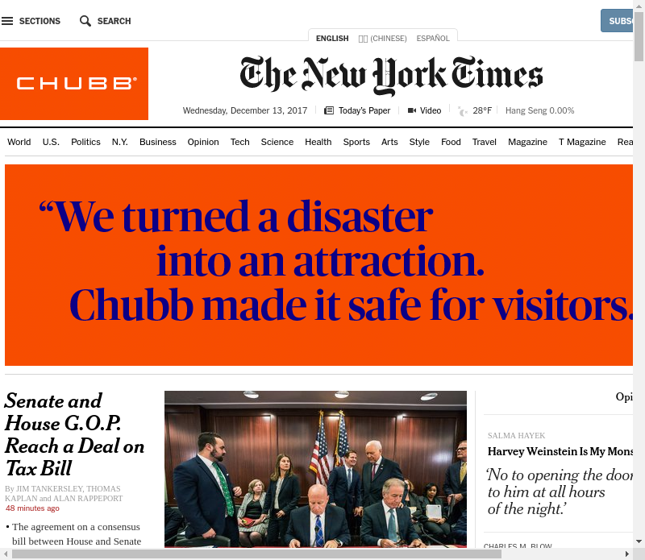

# Who is Watching?

### Original Image


### Extracted Headline


## Motivation

Today we have so many news sources, it's impossible to follow all of
them. This project is a study on media attention. It is interesting to see what
kinds of stories that the media pays attention to, and how they report it.

What can we learn from the way headlines are reported, from the choice of topic,
to the wording used in the topic?

## Implementation

The project is a simple webserver that runs Selenium, and scrapes the sites of a
couple of major publications. The current list is:
1. New York Times
2. Fox News
3. USA Today
4. Washington Post
5. NPR

'Headlines' are extracted(see discussion below) from each site and saved to the
webserver.

### Headline extraction
What is considered a headline is obviously subject to interpretation. In the
case of this project, it is the first, large body of text on the page, where
precedence is given as so: top > right > left > bottom. The original images
before the crop are also served so the user may inspect it.

The html element of the headline is also given a 'normalizing' treatment of
white background and black text. This is an aesthetic modification for the
display.


# Development

Assumes that pip is installed on the machine. If pyenv is installed on the
machine, a virtualenv can be created for the root folder - note that there is a
.python-version in the root. The command for that would be:

```
pyenv virtualenv 3.5.1 your_env_name
pyenv local your_env_name # set the local version
```

Otherwise, pipenv can manage environments for you.


### Server
```
cd server
pip install pipenv
pipenv install

export FLASK_APP=app.py
export FLASK_DEBUG=1

flask run # if using pyenv
pipenv run python flask run # if NOT using pyenv

```

The server also has other dependencies on chrome, etc, which will be captured
using a Dockerfile or ansible

### Scraper

The scraper will try to use a docker container if possible, otherwise it will try
to run the selenium host locally. Local selenium host works well on OSX but
almost impossible to get right on the cloud. The who_is_watching.py python
script tries to look for the docker host through the DOCKER_HOST env, which is
set when running Docker Toolbox. If running Docker for Mac, DOCKER_HOST may need
to be manually set to localhost.
```
export DOCKER_HOST=http://localhost
```

```
# ensure that docker is installed and running, obviously
docker run -d -p 4444:4444 --name selenium --shm-size=2g selenium/standalone-chrome:3.8.1-bohrium

cd scraper
pip install pipenv
pipenv install

python who_is_watching.py # if using pyenv
pipenv run python who_is_watching.py # if NOT using pyenv
```
